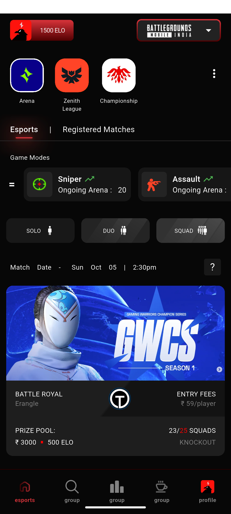
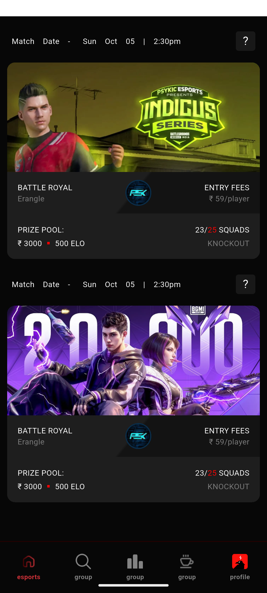

# Esports App UI

A premium, dark-themed Esports tournament application UI built with Flutter. This project demonstrates a pixel-perfect implementation of a modern design, featuring complex layouts, custom widgets, and responsive elements.

## � Screenshots

<p align="center">
  
  
</p>

## �📱 Features

- **Dynamic Header Section**:
  - Custom ELO badge with gradient borders.
  - Game Selector with a unique gradient border and dropdown interaction.
  - Category navigation (Arena, Zenith League, Championship) with custom assets.
  - "Esports | Registered Matches" tab system with glowing effects.

- **Game Mode Selector**:
  - Horizontal scrollable list of game modes (Sniper, Assault, SMG).
  - Custom card design with background images and gradient overlays.

- **Filter Section**:
  - Interactive filter chips for Match Types (Solo, Duo, Squad).
  - Custom assets for filter types.

- **Match Cards**:
  - Detailed match information display (Date, Time, Entry Fee).
  - Angled gradient background for a dynamic visual effect.
  - Central logo placement with "Battle Royal" and map details.

- **Custom Bottom Navigation**:
  - Styled bottom bar with specific icons for navigation.

## 🛠️ Tech Stack

- **Framework**: Flutter
- **Language**: Dart
- **Architecture**: Modular widget-based structure for reusability and maintainability.

## 🌐 API Integration (Dio)

This project uses **Dio** for efficient and robust network requests.

- **Why Dio?**: Chosen for its advanced features like interceptors, global configuration, and better error handling compared to `http`.
- **Implementation Details**:
  - **DioClient**: A singleton wrapper with logging interceptors and default headers (including `User-Agent` to bypass 403 errors).
  - **Repository Pattern**: `MatchRepository` handles data fetching and transformation, keeping the UI clean.
  - **State Management**: `Provider` manages the data flow, ensuring the UI updates automatically when data is fetched.

## 📂 Project Structure

```
lib/
├── constants/          # App-wide constants (Colors, TextStyles)
├── screens/            # Screen widgets (HomeScreen)
├── widgets/            # Reusable UI components
│   ├── header_section.dart
│   ├── game_mode_selector.dart
│   ├── filter_section.dart
│   ├── match_card.dart
│   └── custom_bottom_nav_bar.dart
└── main.dart           # Application entry point
```

## 🚀 Getting Started

1.  **Clone the repository**:
    ```bash
    git clone [https://github.com/codemacUT/Assignment]
    ```
2.  **Navigate to the project directory**:
    ```bash
    cd assignment
    ```
3.  **Install dependencies**:
    ```bash
    flutter pub get
    ```
4.  **Run the app**:
    ```bash
    flutter run
    ```

## 🎨 Design

The UI is designed with a focus on a "Gamer" aesthetic, utilizing:
- Dark mode color palette (`#070707` background).
- Vibrant red accents (`#D7333A`).
- Custom fonts (`LCT Picon`, `Suisse Int'l Mono`).
- Gradient borders and glowing text effects.

## 📌 Notes for Reviewers

- This project is a **frontend-only Flutter implementation** created specifically for the internship assignment.
- The UI is built to match the provided Figma design as closely as possible, focusing on layout accuracy and styling.
- No backend, APIs, or real-time data sources are included—only static UI components.
- All widgets are structured for readability and reusability, following a modular approach.
- The app is responsive across different screen sizes and maintains design consistency.
- The codebase avoids unnecessary complexity and sticks to clean, maintainable Flutter practices.

## 📝 License

This project is open source and available under the [MIT License](LICENSE).
